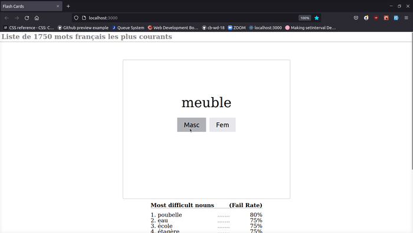

# Flash Card Website using Django and React

This website tests users on the genders of the most common french nouns. 

## Stages

---

### Webscraper

The first stage was to scrape a [wikitionary.org](https://fr.wiktionary.org/wiki/Wiktionnaire:Liste_de_1750_mots_fran%C3%A7ais_les_plus_courants) list of the 1750 most common french nouns. Using Python and the beautiful soup library a database of nouns, along with their definition and gender was build.

### Django Backend

The data was modeled in Django which generated RESTful endpoints to quiery and update the data.

### React Frontend

The frontend was built out using React functional components, and styled with the Styled componenets library.

## Features

---

- Frontend makes API calls to backend to `get` deck of cards.
- The deck of cards is shuffled and the order is saved in local storage.
- User answers are `patched` to the backend to update the rate of failure for each noun.
- The card back tells users if their answer was correct.
- A leaderboard displays metrics on the most challenging nouns.
- When all cards in the deck have been drawn, it is reshuffled and the user starts over.
